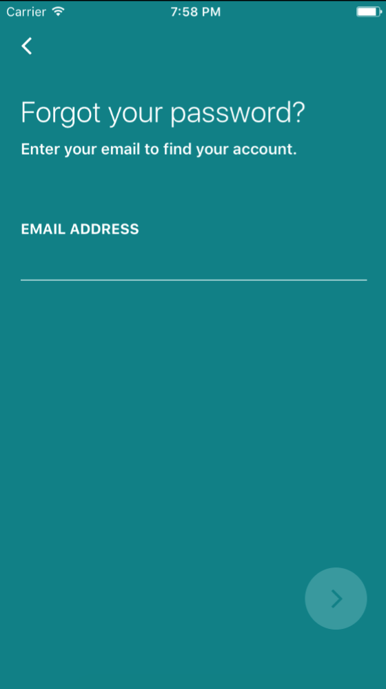

<<<<<<< HEAD
# react-native-airbnb-clone
AirBnB mobile app clone using React Native & Redux

<table>
  <tr>
    <td></td>
    <td></td>
    <td></td>
    <td></td>
  <tr>
  <tr>
    <td></td>
    <td></td>
    <td></td>
    <td></td>
  <tr>
  <tr>
    <td></td>
  <tr>
</table>
=======
>>>>>>> 1b4445be66053437066b87b7f86f7bc2aef30076

## How to use
- Clone
- Run `npm install` in the terminal
- Run on IOS or Android projects in emulator

## Login details
<<<<<<< HEAD
- email: web@imandy.ie
- password: 12345

## Dependencies
- react
- react-native
- react-native-vector-icons
- react-navigation
- react-redux
- redux
- redux-logger
- redux-thunk
=======
- email: web@
- password: 12345
>>>>>>> 1b4445be66053437066b87b7f86f7bc2aef30076
